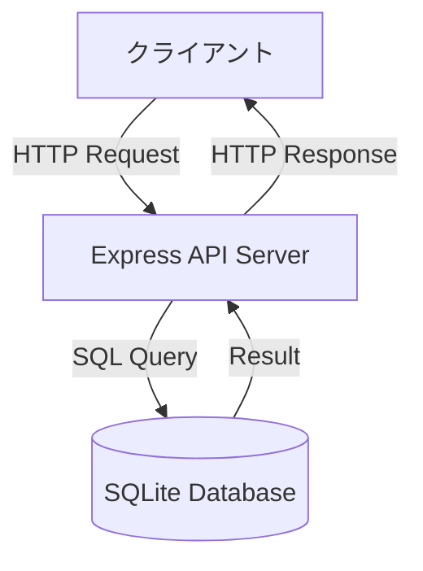
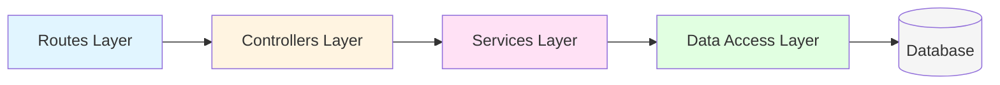
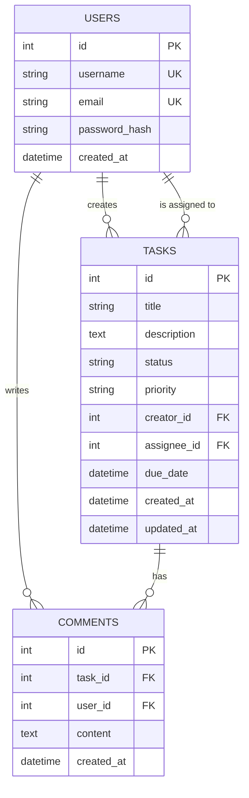
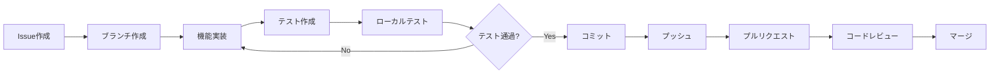

# タスク管理API - 基本設計書

## 1. プロジェクト概要

### 1.1 目的
Claude Codeを用いた並列開発の検証を目的とした、シンプルなタスク管理REST APIの開発。複数の開発者（Claude Codeインスタンス）が同時に異なる機能を実装し、マージする流れを検証する。

### 1.2 主要機能
- タスクのCRUD操作
- ユーザー管理
- タスクへのコメント機能
- タスクのフィルタリング・検索
- タスクの割り当て機能
- 統計情報の取得

### 1.3 技術スタック
- **ランタイム**: Node.js (v18以上)
- **フレームワーク**: Express.js
- **データベース**: SQLite (開発用、シンプルさ重視)
- **ORM**: なし（シンプルな生SQL）
- **バリデーション**: express-validator
- **テスト**: Jest + Supertest
- **リンター**: ESLint
- **フォーマッター**: Prettier

---

## 2. システムアーキテクチャ

### 2.1 全体構成



### 2.2 レイヤー構成



- **Routes Layer**: エンドポイント定義、リクエストルーティング
- **Controllers Layer**: リクエスト/レスポンス処理、バリデーション
- **Services Layer**: ビジネスロジック
- **Data Access Layer**: データベース操作

---

## 3. データモデル

### 3.1 ER図



### 3.2 テーブル定義

#### users テーブル
| カラム名 | 型 | 制約 | 説明 |
|---------|-----|------|------|
| id | INTEGER | PRIMARY KEY, AUTOINCREMENT | ユーザーID |
| username | TEXT | NOT NULL, UNIQUE | ユーザー名 |
| email | TEXT | NOT NULL, UNIQUE | メールアドレス |
| password_hash | TEXT | NOT NULL | パスワードハッシュ |
| created_at | DATETIME | DEFAULT CURRENT_TIMESTAMP | 作成日時 |

#### tasks テーブル
| カラム名 | 型 | 制約 | 説明 |
|---------|-----|------|------|
| id | INTEGER | PRIMARY KEY, AUTOINCREMENT | タスクID |
| title | TEXT | NOT NULL | タスクタイトル |
| description | TEXT | NULL | タスク詳細 |
| status | TEXT | NOT NULL, DEFAULT 'todo' | ステータス (todo/in_progress/done) |
| priority | TEXT | NOT NULL, DEFAULT 'medium' | 優先度 (low/medium/high) |
| creator_id | INTEGER | NOT NULL, FK | 作成者ID |
| assignee_id | INTEGER | NULL, FK | 担当者ID |
| due_date | DATETIME | NULL | 期限 |
| created_at | DATETIME | DEFAULT CURRENT_TIMESTAMP | 作成日時 |
| updated_at | DATETIME | DEFAULT CURRENT_TIMESTAMP | 更新日時 |

#### comments テーブル
| カラム名 | 型 | 制約 | 説明 |
|---------|-----|------|------|
| id | INTEGER | PRIMARY KEY, AUTOINCREMENT | コメントID |
| task_id | INTEGER | NOT NULL, FK | タスクID |
| user_id | INTEGER | NOT NULL, FK | ユーザーID |
| content | TEXT | NOT NULL | コメント内容 |
| created_at | DATETIME | DEFAULT CURRENT_TIMESTAMP | 作成日時 |

---

## 4. API仕様

### 4.1 エンドポイント一覧

#### タスク関連

| メソッド | エンドポイント | 説明 |
|---------|---------------|------|
| GET | /api/tasks | タスク一覧取得（フィルタリング対応） |
| POST | /api/tasks | タスク作成 |
| GET | /api/tasks/:id | タスク詳細取得 |
| PUT | /api/tasks/:id | タスク更新 |
| DELETE | /api/tasks/:id | タスク削除 |
| PUT | /api/tasks/:id/assign | タスク割り当て |

#### コメント関連

| メソッド | エンドポイント | 説明 |
|---------|---------------|------|
| GET | /api/tasks/:id/comments | タスクのコメント一覧取得 |
| POST | /api/tasks/:id/comments | コメント作成 |

#### ユーザー関連

| メソッド | エンドポイント | 説明 |
|---------|---------------|------|
| GET | /api/users | ユーザー一覧取得 |
| POST | /api/users | ユーザー作成 |
| GET | /api/users/:id | ユーザー詳細取得 |

#### 統計関連

| メソッド | エンドポイント | 説明 |
|---------|---------------|------|
| GET | /api/stats | タスク統計情報取得 |

### 4.2 詳細仕様例

#### GET /api/tasks

**クエリパラメータ**:
- `status`: フィルタ（todo/in_progress/done）
- `priority`: フィルタ（low/medium/high）
- `assignee_id`: 担当者IDでフィルタ
- `limit`: 取得件数（デフォルト: 50）
- `offset`: オフセット（デフォルト: 0）

**レスポンス例**:
```json
{
  "success": true,
  "data": [
    {
      "id": 1,
      "title": "APIエンドポイント実装",
      "description": "タスクCRUDのエンドポイントを実装する",
      "status": "in_progress",
      "priority": "high",
      "creator_id": 1,
      "assignee_id": 2,
      "due_date": "2026-02-10T00:00:00Z",
      "created_at": "2026-02-05T10:00:00Z",
      "updated_at": "2026-02-05T14:30:00Z"
    }
  ],
  "pagination": {
    "total": 25,
    "limit": 50,
    "offset": 0
  }
}
```

#### POST /api/tasks

**リクエストボディ**:
```json
{
  "title": "新しいタスク",
  "description": "タスクの詳細説明",
  "priority": "medium",
  "assignee_id": 3,
  "due_date": "2026-02-15T00:00:00Z"
}
```

**レスポンス例**:
```json
{
  "success": true,
  "data": {
    "id": 26,
    "title": "新しいタスク",
    "description": "タスクの詳細説明",
    "status": "todo",
    "priority": "medium",
    "creator_id": 1,
    "assignee_id": 3,
    "due_date": "2026-02-15T00:00:00Z",
    "created_at": "2026-02-05T15:00:00Z",
    "updated_at": "2026-02-05T15:00:00Z"
  }
}
```

---

## 5. ディレクトリ構造

```
task-management-api/
├── src/
│   ├── routes/              # ルーティング定義
│   │   ├── index.js         # ルート集約
│   │   ├── tasks.js         # タスク関連ルート
│   │   ├── users.js         # ユーザー関連ルート
│   │   ├── comments.js      # コメント関連ルート
│   │   └── stats.js         # 統計関連ルート
│   ├── controllers/         # コントローラー
│   │   ├── tasksController.js
│   │   ├── usersController.js
│   │   ├── commentsController.js
│   │   └── statsController.js
│   ├── services/            # ビジネスロジック
│   │   ├── taskService.js
│   │   ├── userService.js
│   │   ├── commentService.js
│   │   └── statsService.js
│   ├── db/                  # データベース関連
│   │   ├── connection.js    # DB接続
│   │   ├── schema.sql       # スキーマ定義
│   │   └── seed.sql         # 初期データ
│   ├── middleware/          # ミドルウェア
│   │   ├── errorHandler.js  # エラーハンドリング
│   │   └── validators.js    # バリデーション
│   ├── utils/               # ユーティリティ
│   │   ├── logger.js        # ログ
│   │   └── constants.js     # 定数定義
│   └── app.js               # Expressアプリ設定
├── tests/                   # テストコード
│   ├── tasks.test.js
│   ├── users.test.js
│   ├── comments.test.js
│   └── stats.test.js
├── docs/                    # ドキュメント
│   └── basic-design.md      # 基本設計書
├── .gitignore
├── package.json
├── jest.config.js
├── .eslintrc.js
├── .prettierrc
├── README.md
└── server.js                # エントリーポイント
```

---

## 6. 並列開発のためのIssue分割案

並列開発を検証するため、以下のIssueに分割することを推奨します。各Issueは比較的独立しており、同時開発が可能です。

### Issue #1: プロジェクトセットアップ
- `package.json`作成
- 基本的なディレクトリ構造構築
- Express基本設定
- ESLint/Prettier設定

### Issue #2: データベース設計と初期化
- SQLiteセットアップ
- スキーマ定義（schema.sql）
- DB接続モジュール（db/connection.js）
- シードデータ作成

### Issue #3: ユーザー管理機能
- ユーザーCRUDエンドポイント実装
- routes/users.js
- controllers/usersController.js
- services/userService.js
- tests/users.test.js

### Issue #4: タスクCRUD機能（基本）
- タスクCRUD基本エンドポイント実装
- routes/tasks.js
- controllers/tasksController.js
- services/taskService.js（基本機能）
- tests/tasks.test.js（基本テスト）

### Issue #5: タスクフィルタリング機能
- タスク一覧のフィルタリング実装
- services/taskService.jsへのフィルタロジック追加
- クエリパラメータ対応
- tests/tasks.test.js（フィルタテスト追加）

### Issue #6: タスク割り当て機能
- タスク割り当てエンドポイント実装
- PUT /api/tasks/:id/assign
- controllers/tasksController.js（assign機能追加）
- services/taskService.js（割り当てロジック）
- tests/tasks.test.js（割り当てテスト追加）

### Issue #7: コメント機能
- コメントCRUDエンドポイント実装
- routes/comments.js
- controllers/commentsController.js
- services/commentService.js
- tests/comments.test.js

### Issue #8: 統計情報機能
- タスク統計エンドポイント実装
- routes/stats.js
- controllers/statsController.js
- services/statsService.js
- tests/stats.test.js

### Issue #9: エラーハンドリングとバリデーション
- グローバルエラーハンドラー実装
- middleware/errorHandler.js
- middleware/validators.js
- 各エンドポイントへのバリデーション追加

### Issue #10: ドキュメントとREADME
- API仕様書詳細化
- README.md作成
- セットアップ手順
- 使用例

---

## 7. 並列開発時の競合ポイント

以下のファイルは複数のIssueで変更される可能性が高く、マージコンフリクトが発生しやすい：

### 高頻度の競合が予想されるファイル
- `src/routes/index.js` - 全ルートの集約
- `src/app.js` - ミドルウェア登録
- `package.json` - 依存関係追加
- `README.md` - ドキュメント更新

### 競合解決の方針
1. こまめなpull/rebase
2. 機能ごとのブランチ戦略
3. コードレビューでの調整
4. 共通部分の早期実装

---

## 8. 開発フロー



---

## 9. テスト戦略

### 9.1 テストレベル
- **単体テスト**: 各サービス層の関数
- **統合テスト**: APIエンドポイントのE2Eテスト

### 9.2 テストカバレッジ目標
- 全体: 80%以上
- Services層: 90%以上
- Controllers層: 80%以上

### 9.3 テスト実行
```bash
# 全テスト実行
npm test

# カバレッジ付き実行
npm run test:coverage

# 監視モード
npm run test:watch
```

---

## 10. セットアップ手順

### 10.1 必要な環境
- Node.js v18以上
- npm v9以上

### 10.2 初回セットアップ
```bash
# 依存関係インストール
npm install

# データベース初期化
npm run db:init

# 開発サーバー起動
npm run dev
```

### 10.3 開発コマンド
```bash
# 開発サーバー起動（ホットリロード）
npm run dev

# テスト実行
npm test

# リンター実行
npm run lint

# フォーマッター実行
npm run format
```

---

## 11. 非機能要件

### 11.1 パフォーマンス
- API応答時間: 200ms以内（通常時）
- 同時接続数: 100接続まで対応

### 11.2 セキュリティ
- パスワードはbcryptでハッシュ化
- SQLインジェクション対策（パラメータ化クエリ）
- XSS対策（入力サニタイズ）

### 11.3 可用性
- 開発環境での使用を想定
- エラー時の適切なHTTPステータスコード返却
- 詳細なエラーログ出力

---

## 12. 今後の拡張案

並列開発検証後、以下の機能を追加可能：
- 認証・認可（JWT）
- タスクのタグ機能
- ファイル添付機能
- 通知機能
- タスクの並び替え/ドラッグ&ドロップ
- PostgreSQL/MySQLへの移行
- Docker対応
- CI/CD設定

---

## 13. 参考資料

- [Express.js公式ドキュメント](https://expressjs.com/)
- [Jest公式ドキュメント](https://jestjs.io/)
- [SQLite公式ドキュメント](https://www.sqlite.org/docs.html)
- [RESTful API設計ガイド](https://restfulapi.net/)

---

**作成日**: 2026-02-05
**バージョン**: 1.0.0
**作成者**: Claude Code
